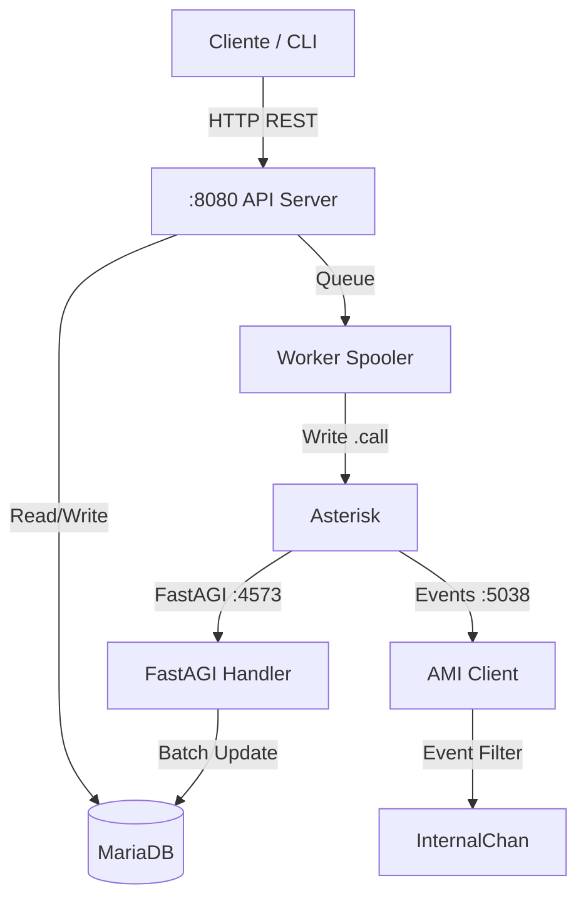

# Microservicio Apicall

Microservicio de alto rendimiento en Go para gestión de campañas de llamadas automatizadas (IVR), independiente de Vicidial. Diseñado para manejar miles de llamadas concurrentes con robustez, reintentos y optimización de base de datos.

## 🚀 Características Principales

*   **Alto Rendimiento**: Capacidad para miles de llamadas concurrentes (probado con 100+ CPS).
*   **Diseño Microservicio**: Arquitectura modular (API + AMI + FastAGI + Worker).
*   **FastAGI Server**: Control total del flujo de llamadas en Go (puerto 4573).
*   **Multi-Tenancy**: Soporte para múltiples "Proyectos" (campañas) con configuraciones independientes.
*   **Base de Datos Optimizada**: Uso de **Batching** para escrituras masivas, reduciendo la carga en DB en un 90%.
*   **Smart Caller ID**: Rotación inteligente de Caller IDs y generación dinámica para mejorar la tasa de respuesta (Local Presence).
*   **AMD (Answering Machine Detection)**: Detección de voz rápida y ajustable para minimizar latencia.
*   **Resiliencia**:
    *   **Rate Limiting**: Control de CPS configurable.
    *   **Panic Recovery**: El servicio no se detiene por errores aislados.
    *   **AMI Reconnect**: Reconexión automática robusta con Asterisk.
*   **API REST**: Gestión remota completa (Proyectos, Troncales, Llamadas).
*   **CLI Remota**: Herramienta `apicall-cli` para administración desde cualquier PC.

---

## 🛠 Arquitectura



---

## 📦 Instalación

### 1. Requisitos
*   Linux (Debian/Ubuntu/CentOS)
*   Asterisk 16+
*   MariaDB / MySQL

### 2. Despliegue Rápido
1.  **Copiar binarios**:
    ```bash
    cp bin/apicall /usr/local/bin/
    cp bin/apicall-cli /usr/local/bin/
    chmod +x /usr/local/bin/apicall*
    ```

2.  **Base de Datos**:
    ```bash
    mysql -u root -p < migrations/001_initial.sql
    mysql -u root -p < migrations/002_add_retries.sql
    mysql -u root -p < migrations/003_add_disposition.sql
    mysql -u root -p < migrations/004_add_amd.sql
    mysql -u root -p < migrations/005_add_troncales.sql
    mysql -u root -p < migrations/006_smart_cid.sql
    ```

3.  **Configuración**:
    ```bash
    mkdir -p /etc/apicall
    cp configs/apicall.yaml /etc/apicall/
    nano /etc/apicall/apicall.yaml
    ```
    *Ajustar credenciales de BD y AMI.*

4.  **Integración Asterisk**:
    Añadir a `/etc/asterisk/extensions_custom.conf`:
    ```asterisk
    [apicall_context]
    exten => s,1,AGI(agi://127.0.0.1:4573,${APICALL_PROYECTO_ID})
    same => n,Hangup()

    [apicall_outbound]
    exten => _X.,1,Dial(SIP/${APICALL_TRUNK}/${APICALL_PREFIX}${EXTEN},60)
    same => n,Hangup()
    ```

5.  **Servicio Systemd**:
    ```bash
    cp configs/apicall.service /etc/systemd/system/
    systemctl daemon-reload
    systemctl enable --now apicall
    ```

---

## 💻 CLI Remota (`apicall-cli`)

Herramienta para gestionar el sistema desde tu PC sin acceso SSH a la base de datos.
Requiere acceso al puerto API (8080).

### Uso Básico
```bash
export APICALL_HOST="http://209.38.233.46:8080"

# Listar Proyectos
apicall-cli --host $APICALL_HOST project list

# Crear Proyecto
apicall-cli --host $APICALL_HOST project add \
  --id 100 \
  --nombre "Cobranza MX" \
  --trunk "Trunk_SIP" \
  --cid "5550001234" \
  --amd true \
  --smart-cid true

# Listar Troncales
apicall-cli --host $APICALL_HOST trunk list

# Lanzar Llamada de Prueba
apicall-cli --host $APICALL_HOST call --project 100 --number 525512345678
```

---

---

## 🔌 API REST (v1)

Base URL: `http://<IP>:8080/api/v1`

### 🔐 Autenticación

**Credenciales por defecto:**
- Usuario: `admin`
- Contraseña: `admin123`

**Login:**
```bash
curl -X POST http://IP:8080/api/v1/login \
  -H "Content-Type: application/json" \
  -d '{"username":"admin","password":"admin123"}'
  
# Response: {"token":"eyJ...", "user":{...}}
```

**Usar el token en requests:**
```bash
curl -H "Authorization: Bearer <TOKEN>" http://IP:8080/api/v1/proyectos
```

### 📋 Endpoints

#### Públicos (Sin autenticación)
| Método | Endpoint | Descripción |
|--------|----------|-------------|
| `POST` | `/login` | Autenticación (retorna JWT) |
| `GET` | `/health` | Health check |

#### Protegidos (Requieren JWT)

**Proyectos:**
| Método | Endpoint | Descripción |
|--------|----------|-------------|
| `GET` | `/proyectos` | Listar proyectos |
| `POST` | `/proyectos` | Crear proyecto |
| `DELETE` | `/proyectos/delete?id=X` | Eliminar proyecto |

**Troncales:**
| Método | Endpoint | Descripción |
|--------|----------|-------------|
| `GET` | `/troncales` | Listar troncales SIP |
| `POST` | `/troncales` | Crear troncal SIP |
| `DELETE` | `/troncales/delete?id=X` | Eliminar troncal |

**Llamadas:**
| Método | Endpoint | Descripción |
|--------|----------|-------------|
| `POST` | `/call` | Encolar llamada |
| `GET` | `/logs?proyecto_id=X&limit=100` | Obtener logs |
| `POST` | `/logs/status` | Actualizar estado (usado por Asterisk) |

**Usuarios (Admin only):**
| Método | Endpoint | Descripción |
|--------|----------|-------------|
| `GET` | `/users` | Listar usuarios |
| `POST` | `/users` | Crear usuario |
| `DELETE` | `/users/delete?id=X` | Eliminar usuario |

**Audios (Admin only):**
| Método | Endpoint | Descripción |
|--------|----------|-------------|
| `GET` | `/audios` | Listar audios |
| `POST` | `/audios/upload` | Subir audio (multipart/form-data) |
| `DELETE` | `/audios/delete?name=X` | Eliminar audio |

**Ejemplo Crear Llamada:**
```json
POST /api/v1/call
Authorization: Bearer eyJ...
{
  "proyecto_id": 100,
  "telefono": "573001234567"
}
```

---

## 🎨 Dashboard Web

Accede al panel de administración en: `http://<IP>:8080`

**Funcionalidades:**
- 📊 Dashboard con estadísticas en tiempo real
- 📞 Gestión de Proyectos y Troncales SIP
- 🎵 Carga y administración de audios (formatos: wav, gsm, ulaw, alaw, sln, mp3)
- 📈 Reportes de llamadas con filtros por proyecto y fecha
- 👥 Administración de usuarios y roles (Admin/Supervisor/Viewer)
- 🧪 Pruebas de llamadas en vivo

**Roles de Usuario:**
- **Admin**: Acceso total, gestión de usuarios
- **Supervisor**: Solo proyectos asignados
- **Viewer**: Solo lectura

---

## ⚙️ Configuración Avanzada

### Smart Caller ID
Si se activa (`smart_active: true` en proyecto), el sistema intentará usar un Caller ID que coincida con el prefijo del destino ("Local Presence").

### AMD Tuning
Para reducir latencia en detección de voz, editar `internal/fastagi/session.go` o recompilar.
Parámetros actuales optimizados: `2500|1500|1000|5000|100|50|4|256`.

### IP Whitelist
En la configuración del proyecto, el campo `ips_permitidas` acepta:
*   Lista separada por comas: `1.2.3.4,10.0.0.0/24`
*   `*` (Asterisco) o Vacio: **Permitir cualquier IP** (Cuidado en producción).

---

## 🔍 Troubleshooting

**Ver logs en tiempo real:**
```bash
journalctl -u apicall -f
```

**Errores Comunes:**
*   `Connection refused`: La API no está corriendo o firewall bloquea puerto 8080.
*   `[AMI] Canal lleno`: (Solucionado) El buffer de eventos AMI se desbordaba. Ahora se descartan silenciosamente si no hay consumidor.
*   `Slice bounds out of range`: (Solucionado) Condición de carrera en reconexión AMI. Parcheado en v1.1.

---

Desarrollado con ❤️ en Go.
